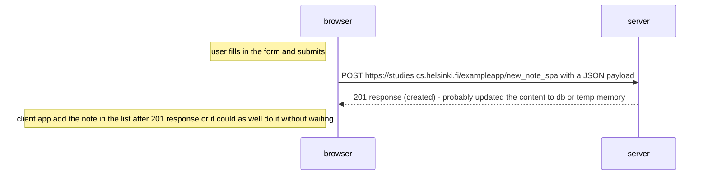

```mermaid
sequenceDiagram
  participant browser 
  participant server

  Note left of browser: user fills in the form and submits
  browser->>server: POST https://studies.cs.helsinki.fi/exampleapp/new_note_spa with a JSON payload
  server-->>browser: 201 response (created) - probably updated the content to db or temp memory
  Note left of browser: client app add the note in the list after 201 response or it could as well do it without waiting
```
